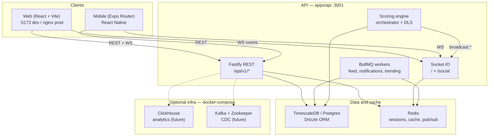

# CricScore Architecture

Reference for how the monorepo fits together: clients, API, real-time layer, data stores, and validation boundaries.

---

## System diagram



**Request flow (live scoring):**

1. Scorer submits a ball via `POST /api/v1/matches/:id/deliveries`.
2. `scoring-orchestrator` runs the engine, persists to Postgres, updates scorecards.
3. `broadcast.*` emits Socket.IO events to room `match:{id}`.
4. Web/mobile clients in that room update UI without polling.

**Production edge:** nginx serves the SPA, proxies `/api/` and `/socket.io/` to the API container (`apps/web/nginx.conf.template`).

---

## Monorepo layout

| Package | Path | Role |
|---------|------|------|
| API | `apps/api` | Fastify REST, Socket.IO, Drizzle, BullMQ workers |
| Web | `apps/web` | React SPA, TanStack Query, offline scoring (IndexedDB) |
| Mobile | `apps/mobile` | Expo Router app, offline sync |
| Shared | `packages/shared` | Zod schemas, WS event types, domain enums |
| UI | `packages/ui` | Tailwind tokens and shared styles |

**Key API directories**

| Path | Purpose |
|------|---------|
| `apps/api/src/routes/` | REST route modules (registered in `server.ts`) |
| `apps/api/src/engine/` | Scoring, DLS, commentary, fantasy scoring |
| `apps/api/src/services/realtime.ts` | Socket.IO init, match + social broadcast helpers |
| `apps/api/src/services/scoring-orchestrator.ts` | Delivery pipeline + WS fan-out |
| `apps/api/src/db/schema/` | Drizzle table definitions |
| `apps/api/src/middleware/validation.ts` | `validateBody` + API-specific schema extensions |
| `packages/shared/src/schemas/` | Shared Zod schemas consumed by API and clients |

---

## Route map

### Web SPA (`apps/web/src/App.tsx`)

| Path | Page | Purpose |
|------|------|---------|
| `/login` | LoginPage | Auth |
| `/` | HomePage | Match list / dashboard |
| `/matches/new` | CreateMatchPage | Create match wizard |
| `/matches/:id/score` | ScoringPage | Live scoring UI |
| `/matches/:id/scorecard` | ScorecardPage | Full scorecard |
| `/matches/:id/analytics` | AnalyticsPage | Charts (wagon wheel, worm, etc.) |
| `/matches/:id/overs` | OverByOverPage | Over-by-over view |
| `/tournaments` | TournamentPage | Tournament list |
| `/tournaments/:id` | TournamentPage | Tournament detail / fixtures |
| `/feed` | FeedPage | Social activity feed |
| `/fantasy` | FantasyPage | Fantasy contests |
| `/records` | RecordsPage | Records / leaderboards |
| `/settings` | SettingsPage | User settings |

### Mobile (`apps/mobile/app/` — Expo Router)

| Screen | File | Purpose |
|--------|------|---------|
| `(tabs)/index` | Home tab | Dashboard |
| `(tabs)/matches` | Match list | Browse matches |
| `(tabs)/score` | Quick score entry | Scoring shortcut |
| `(tabs)/chat` | Chat list | Messaging |
| `(tabs)/profile` | Profile | Account |
| `login` | Login | Auth |
| `register` | Register | Sign up |
| `matches/new` | New match | Create match |
| `matches/[id]/score` | Live score | Scoring |
| `matches/[id]/scorecard` | Scorecard | Read-only card |
| `chat/[id]` | Chat room | Direct / group chat |

### REST API (`/api/v1`)

OpenAPI UI: `http://localhost:3001/docs` (dev).

#### Infrastructure

| Method | Path | Auth | Notes |
|--------|------|------|-------|
| GET | `/health` | Public | DB + Redis health |
| GET | `/metrics` | Admin/internal | Prometheus |
| GET | `/apm/*` | Admin/internal | APM endpoints |
| GET | `/docs` | Public | Swagger UI |

#### Auth — `/api/v1/auth`

| Method | Path |
|--------|------|
| POST | `/register`, `/login`, `/refresh`, `/logout` |
| POST | `/forgot-password`, `/reset-password` |
| POST | `/verify-email`, `/resend-verification` |
| GET | `/sessions` |
| DELETE | `/sessions/:tokenId` |
| GET | `/.well-known/jwks.json` |

#### Matches and scoring — `/api/v1/matches`

| Method | Path | Notes |
|--------|------|-------|
| GET | `/`, `/:id`, `/:id/state`, `/:id/dls` | Read match state |
| POST | `/`, `/:id/start`, `/:id/toss`, `/:id/interruption`, `/:id/resume`, `/:id/super-over` | Lifecycle |
| PATCH | `/:id` | Update metadata |
| DELETE | `/:id` | Soft delete |
| POST | `/:id/scorers`, DELETE `/:id/scorers/:userId` | Scorer assignment |
| POST | `/:id/substitutions` | Player substitutions |
| POST | `/:id/deliveries` | Record ball |
| GET | `/:id/deliveries` | Delivery log |
| DELETE | `/:id/deliveries/last`, `/:id/deliveries/batch` | Undo |
| PATCH | `/:id/deliveries/:ballId` | Edit delivery |
| GET | `/:id/scorecard`, `/:id/scorecard/pdf`, `/:id/innings/:inningsId/scorecard` | Scorecards |
| GET/PATCH | `/:id/commentary`, `/:id/commentary/:commentaryId` | Commentary |
| POST | `/:id/innings`, `/:id/innings/:inningsId/declare`, `/:id/innings/:inningsId/bowler`, `/:id/innings/:inningsId/new-batsman`, `/:id/innings/:inningsId/follow-on` | Innings control |
| POST | `/:id/session/break`, `/:id/session/resume` | Session breaks |
| POST/PATCH | `/:id/reviews`, `/:id/reviews/:reviewId` | DRS reviews |
| GET | `/:id/audit-log` | Audit trail |
| GET/POST | `/:id/reactions` | Emoji reactions |
| GET | `/:id/presence` | Spectator count (REST) |

#### Players and teams

| Prefix | Highlights |
|--------|------------|
| `/api/v1/players` | CRUD, `/:id/form`, `/:id/teams`, `/:id/career-stats` |
| `/api/v1/teams` | CRUD |

#### Analytics — `/api/v1/analytics` (GET, mostly public)

`/matches/:matchId/wagon-wheel`, `/worm-chart`, `/manhattan`, `/pitch-map`, `/partnerships`, `/phase-stats`  
`/players/:playerId/head-to-head`

#### Social and engagement

| Prefix | Highlights |
|--------|------------|
| `/api/v1/users` | `/me` profile, GDPR export/delete, avatar |
| `/api/v1/users` (social) | follow, feed, likes, suggestions |
| `/api/v1/chat` | rooms, messages, direct |
| `/api/v1/notifications` | inbox, preferences, push device tokens |
| `/api/v1/fantasy` | contests, teams, leaderboard |
| `/api/v1/leaderboards` | batting, bowling, xp, fantasy, `/me` |
| `/api/v1/trending` | players, teams, matches |

#### Tournaments and broadcast

| Prefix | Highlights |
|--------|------------|
| `/api/v1/tournaments` | CRUD, fixtures, points table |
| `/api/v1/format-configs` | Match format presets |
| `/api/v1/venues/:venue/stats` | Venue aggregates |
| `/api/v1/broadcaster/matches/:id/*` | TV overlay feed (API key) |

**Auth defaults:** JWT on all routes except public paths (health, auth, scorecard GET, analytics GET, Swagger). Broadcaster routes use `x-api-key`. See `isPublicRoute()` in `apps/api/src/server.ts`.

---

## WebSocket event catalog

Socket.IO shares port **3001** with HTTP. Clients connect to the API origin (or `VITE_WS_URL` in web).

### Default namespace — match rooms

**Rooms:** clients join `match:{matchId}` via `join_match`.

#### Client to server

| Event | Payload | Notes |
|-------|---------|-------|
| `join_match` | `{ match_id: string }` | Validates room access (`socket-auth`) |
| `leave_match` | `{ match_id: string }` | Leave room |
| `submit_delivery` | delivery payload | Logged only; scoring uses REST |
| `undo_last_ball` | `{ matchId: string }` | Logged only; undo uses REST |

#### Server to client (pattern `match:{id}:<type>`)

| Event | Type (shared) | Emitted when | Source |
|-------|---------------|--------------|--------|
| `match:{id}:delivery` | `DeliveryEvent` | Ball recorded (non-wicket) | `scoring-orchestrator` |
| `match:{id}:wicket` | `WicketEvent` | Wicket fall | `scoring-orchestrator` |
| `match:{id}:over` | `OverEvent` | Over completed | `scoring-orchestrator` |
| `match:{id}:milestone` | `MilestoneEvent` | Fifty, century, 5-wkt, etc. | `scoring-orchestrator` |
| `match:{id}:prediction` | `PredictionEvent` | Win probability update | `scoring-orchestrator` |
| `match:{id}:dls_update` | `DLSUpdateEvent` | DLS recalculation | Defined in shared types; wired on DLS paths |
| `match:{id}:status` | `StatusEvent` | Match status change | Orchestrator + match routes |
| `error` | `{ code, message }` | Join denied | `realtime.ts` |

**Payload shapes:** `packages/shared/src/types/events.ts`  
**Web helpers:** `apps/web/src/lib/socket.ts` (`WS_EVENTS`, `joinMatch`, `leaveMatch`)

**Auth:** optional JWT in `handshake.auth.token`; private matches require identity. Dev-only `x-user-id` when `ALLOW_DEV_AUTH=true`.

**Scaling:** Redis adapter on Socket.IO for multi-instance fan-out.

### `/social` namespace — chat and notifications

Requires authenticated JWT (disconnects otherwise).

#### Client to server

| Event | Payload |
|-------|---------|
| `chat:join` | `{ roomId: string }` |
| `chat:leave` | `{ roomId: string }` |
| `chat:typing` | `{ roomId: string }` |
| `chat:read` | `{ roomId: string }` |

#### Server to client

| Event | Payload | Notes |
|-------|---------|-------|
| `chat:message` | `{ roomId, message }` | New message in room |
| `chat:typing` | `{ roomId, userId }` | Typing indicator |
| `chat:read` | `{ roomId, userId, readAt }` | Read receipt |
| `notification:new` | notification object | Sent to room `user:{userId}` |

**Web client:** `apps/web/src/lib/social-socket.ts`

### Presence

On join/leave, presence counts update in-memory (`presence.ts`) and expose via `GET /api/v1/matches/:id/presence`.

---

## Schema to route table

Shared Zod schemas live in `packages/shared/src/schemas/index.ts`. The API re-exports them from `apps/api/src/middleware/validation.ts` and applies `validateBody` on write routes.

| Schema | Defined in | Validated route(s) | Validation mechanism |
|--------|------------|--------------------|----------------------|
| `registerSchema` | `@cricket/shared` | `POST /api/v1/auth/register` | `validateBody` |
| `loginSchema` | `@cricket/shared` | `POST /api/v1/auth/login` | `validateBody` |
| `createMatchSchema` | `@cricket/shared` | `POST /api/v1/matches` | `validateBody` |
| `deliveryInputSchema` | `@cricket/shared` | — | Base for API extension |
| `recordDeliverySchema` | `validation.ts` | `POST /api/v1/matches/:id/deliveries` | `validateBody` (extends `deliveryInputSchema` + wicket/dead-ball refinements) |
| `createPlayerSchema` | `@cricket/shared` | `POST /api/v1/players` | `validateBody` |
| `createTeamSchema` | `@cricket/shared` | `POST /api/v1/teams` | `validateBody` |
| `createTournamentSchema` | `@cricket/shared` | `POST /api/v1/tournaments` | Inline `safeParse` in route |
| `addFixtureSchema` | `@cricket/shared` | `POST /api/v1/tournaments/:id/fixtures` | Inline `safeParse` in route |

**`recordDeliverySchema` extra rules** (beyond shared schema):

- `wicket_type` required when `is_wicket` is true
- `dismissed_player_id` required when `is_wicket` is true
- Dead ball cannot produce a wicket

**Not yet schema-validated:** most PATCH/POST routes (commentary, reviews, fantasy, chat, etc.) accept bodies without shared Zod middleware.

---

## 15-minute onboarding guide

For a new developer with Node >= 20 and Docker installed.

### Minutes 0–3 — Clone and boot infra

```bash
git clone <repo-url> cricket_scoring && cd cricket_scoring
npm install
docker compose up -d    # Postgres :5433, Redis :6379, ClickHouse, Kafka
```

Confirm containers: `docker compose ps` (Postgres and Redis should be healthy).

### Minutes 3–5 — Configure API and database

```bash
cp apps/api/.env.example apps/api/.env
npm run db:migrate
npm run db:seed          # optional demo teams/players/matches
```

Skim `apps/api/.env.example` — at minimum `DATABASE_URL`, `REDIS_URL`, and `JWT_SECRET` must be set.

### Minutes 5–8 — Run the stack and click around

```bash
npm run dev              # API :3001, web :5173, mobile via Expo
```

Open **http://localhost:5173**:

1. `/login` — register or use seeded credentials from seed output.
2. `/matches/new` — create a T20 match.
3. `/matches/:id/score` — record a few balls; watch live updates.
4. `/matches/:id/scorecard` — verify aggregates.

Optional: `npm run dev:mobile` in another terminal and scan the Expo QR code.

### Minutes 8–11 — API and real-time

1. Open **http://localhost:3001/docs** — browse OpenAPI routes.
2. `GET http://localhost:3001/health` — confirm `database: ok`, `redis: ok`.
3. Trace one delivery:
   - Route: `apps/api/src/routes/deliveries.ts`
   - Orchestrator: `apps/api/src/services/scoring-orchestrator.ts`
   - Broadcast: `apps/api/src/services/realtime.ts`
4. Web socket client: `apps/web/src/lib/socket.ts` + `apps/web/src/hooks/useMatchSocket.ts`.

### Minutes 11–13 — Tests and agent workflow

```bash
npm test                           # Vitest: API + web + mobile
npm run test:e2e                   # bash smoke against :3001
npm run test:e2e:playwright        # Playwright UI smoke (web)
```

Read [AGENTS.md](../AGENTS.md) — run `npm run context:status` before making changes; update handoff with `npm run context:update` when done.

### Minutes 13–15 — Mental model checklist

| Question | Where to look |
|----------|---------------|
| How is a ball scored? | `deliveries.ts` → `scoring-orchestrator.ts` → `engine/scoring-engine.ts` |
| Where are types shared? | `packages/shared` |
| How does offline scoring work? | `apps/web/src/lib/offline-store.ts`, `apps/mobile/lib/offline-sync.ts` |
| How is auth enforced? | `server.ts` JWT hook, `middleware/auth.ts`, `services/socket-auth.ts` |
| What is deployed? | `docker-compose.staging.yml`, `docker-compose.prod.yml`, `.github/workflows/deploy.yml` |

**Next steps after onboarding:** pick a route module under `apps/api/src/routes/`, add a Vitest test, run `npm test`, and open a PR.

---

## Related docs

| Doc | Purpose |
|-----|---------|
| [README.md](../README.md) | Setup, tests, deploy |
| [AGENTS.md](../AGENTS.md) | Agent handoff workflow |
| [ARCHITECTURE_REVIEW.md](../ARCHITECTURE_REVIEW.md) | Deep audit notes and gaps |
| [context.md](../context.md) | Original product/API spec |
